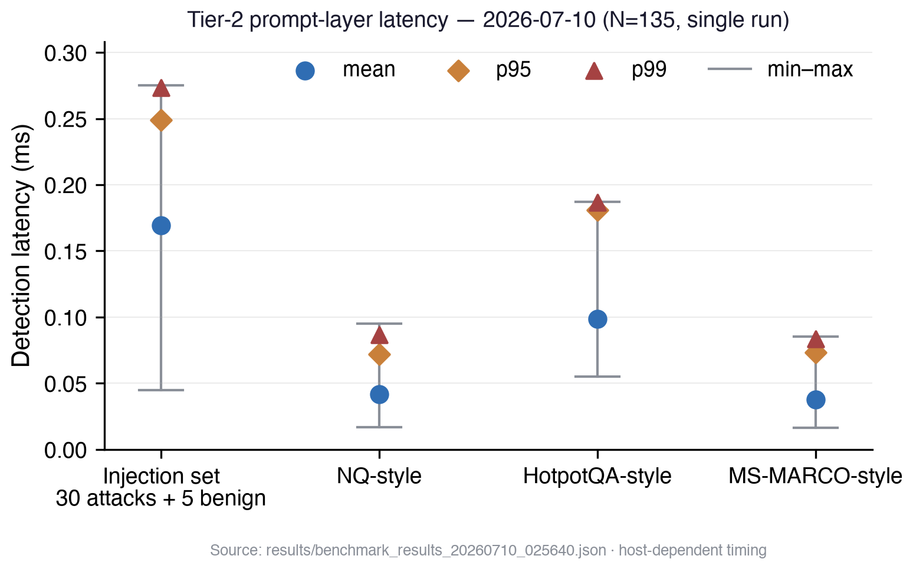

# EmbedGuard: Cross-Layer Detection and Provenance Attestation for Adversarial Embedding Attacks in RAG Systems

**Author:** Neeraj Kumar Singh Beshane

Independent Researcher, California, USA

*Corresponding Author: b.neerajkumarsingh@gmail.com*

**Competing Interests:** The author is an employee of Parafin. This work was conducted independently and is not affiliated with the author's employer.

Post-publication manuscript version: 3.1

**Ethics Statement:** This research evaluates defensive AI-security mechanisms using synthetic attack strings and public benchmark queries. It involves no human participants, private personal data, or testing against live third-party systems. No institutional review was sought. Released attack artifacts are limited to inputs needed to reproduce the detector benchmark and are paired with the corresponding defensive implementation.

---

## Abstract

Embedding-based Retrieval-Augmented Generation (RAG) systems remain vulnerable to corpus poisoning and prompt injection across multiple architectural stages. EmbedGuard proposes a four-layer reference architecture combining prompt detection, embedding provenance, retrieval-distribution monitoring, output-consistency analysis, and a deterministic correlation decision. The target provenance protocol uses an AMD SEV-SNP trust root, while the released package provides only an HMAC software simulation of that protocol; retrieval and output modules are experimental prototypes. The open Tier-2 regression benchmark (N=135) exercises only the 83-pattern prompt detector and observes 30/30 included attacks detected and 0/105 benign queries flagged, with two-sided 95% Wilson intervals of 88.6%-100% for detection and 96.5%-100% for specificity. These fixed, mostly one-example attack categories measure regression-set coverage rather than generalization, corpus-poisoning resistance, hardware attestation, or cross-layer benefit. The IJCESEN version of record separately reports a production-scale four-layer evaluation and an 18.4 percentage-point ablation gain, but the raw predictions, production corpus, baseline configurations, and hardware-attestation logs for that evaluation are not contained in this repository; this revision therefore treats those numbers as archived publication claims rather than independently reproduced evidence. The implementation, Tier-2 inputs, and reproduction scripts are released under Zenodo concept DOI 10.5281/zenodo.18364919.

**Keywords:** Retrieval-Augmented Generation Security, Embedding Space Poisoning, Cross-Layer Attack Detection, Trusted Execution Environments, Cryptographic Provenance Attestation

---

## 1. Introduction

With the advent of large language models and their deployment in enterprise applications, Retrieval-Augmented Generation (RAG) systems have emerged as one of the most impactful architectures for artificial intelligence applications. RAG systems combine the generative capabilities of neural language models with the ability to retrieve information dynamically from external knowledge sources, alleviating critical drawbacks of purely generative models such as knowledge staleness, factual hallucinations, and limited domain coverage (Lewis et al., 2020). This architectural pattern has become ubiquitous in production deployments across healthcare, financial services, legal research, and customer service applications.

Recent security research has identified critical vulnerabilities in RAG retrieval components, particularly embedding space poisoning attacks where adversaries insert maliciously constructed documents into the retrieval knowledge base to influence the generation process (Zou et al., 2024; Liu et al., 2024). These attacks exploit high-dimensional embedding geometry: even minimal corpus contamination (less than 1% of documents) can achieve attack success rates exceeding 80% through strategic semantic space positioning. Research demonstrates that attackers can generate documents that meet retrieval targets for specific query patterns while remaining sufficiently semantically diverse to evade clustering-based outlier detection techniques (Zou et al., 2024). The permanence of embedding attacks differentiates them from transient prompt-based exploits, combining supply chain attack stealth with runtime exploit immediacy to create a distinct and persistent threat surface.

### 1.1 A Live Production Threat, Not a Hypothetical

This threat class has moved from academic demonstration to documented production impact. CVE-2025-32711 (EchoLeak) against Microsoft 365 Copilot demonstrated a network-reachable, zero-click AI command injection with high confidentiality impact in a flagship enterprise assistant (NVD, 2025). ConfusedPilot showed that malicious documents placed inside an enterprise network could alter Microsoft 365 Copilot's responses, suppress legitimate documents, and violate sharing boundaries (Roychowdhury et al., 2024). Phantom demonstrated that a single poisoned document could compromise a commercial RAG application (NVIDIA ChatRTX) black-box, achieving 48% success for passage exfiltration (Chaudhari et al., 2024). Persistent-memory variants of the same pattern have been demonstrated against ChatGPT and Gemini, where injected content in retrievable memory drives continuous data exfiltration (Rehberger, 2024; Rehberger, 2025).

Industry threat frameworks now name this class formally. OWASP's Top 10 for LLM Applications 2025 dedicates LLM08 to Vector and Embedding Weaknesses — exploitation of RAG embedding stores to "inject harmful content, manipulate model outputs, or access sensitive information" — alongside LLM01 (Prompt Injection, explicitly covering indirect injection via retrieved content) and LLM04 (Data and Model Poisoning, explicitly covering manipulated embedding data) (OWASP, 2025). MITRE ATLAS catalogues the attack kill chain with dedicated techniques: AML.T0064 (Gather RAG-Indexed Targets), AML.T0066 (Retrieval Content Crafting), AML.T0070 (RAG Poisoning), and AML.T0071 (False RAG Entry Injection) (MITRE, 2025). NIST's adversarial machine learning taxonomy (AI 100-2e2025) classifies RAG knowledge-base poisoning under NISTAML.013 and indirect prompt injection under NISTAML.015 (Vassilev et al., 2025).

The exposed surface is broad: Menlo Ventures' 2024 survey of 600 U.S. enterprise leaders found RAG at 51% adoption among enterprise generative-AI deployments, up from 31% the prior year (Menlo Ventures, 2024). Half of enterprise AI deployments inherit an attack surface for which named adversary techniques exist, real CVEs have shipped, and — as we argue below — single-layer defenses are structurally insufficient.

### 1.2 Economic and Security Implications

These vulnerabilities have substantial economic implications for organizations deploying RAG systems. Analysis of data breach events demonstrates that artificial intelligence and machine learning systems face unique security challenges that incur significant financial impact. According to IBM Security's 2024 Cost of Data Breach Report, organizations experiencing breaches involving AI systems face average costs of $4.91 million, with mean time to detection and containment extending to 267 days—substantially longer than conventional security incidents (IBM Security, 2024). The persistence of embedding-space attacks exacerbates these costs, as poisoned vectors remain in knowledge bases until manually identified and removed, resulting in prolonged compromise timeframes. This permanence, combined with the difficulty of forensic analysis in high-dimensional embedding spaces, creates extended uncertainty regarding breach scope and impact.

The high-dimensionality of embedding spaces (typically 768 to 1536 dimensions for modern embedding models) enables adversaries to construct documents that preserve semantic relevance for target query patterns while remaining grammatically valid and linguistically coherent, thus evading perplexity-based statistical detectors. Furthermore, adversarial embeddings demonstrate transferability between embedding models, meaning attackers who optimize attacks against publicly available models can successfully transfer them to proprietary models with high confidence of success (Zou et al., 2024; Xiang et al., 2024).

### 1.3 Limitations of Current Defense Mechanisms

Contemporary defense mechanisms primarily adopt stage-specific approaches, optimizing detection for isolated attack surfaces within the RAG architecture. RAGuard employs a two-layer defense combining adversarial retriever training with chunk-wise perplexity filtering and text similarity analysis (Cheng et al., 2025). RobustRAG implements isolate-then-aggregate strategies with certifiable guarantees using keyword-based voting (Xiang et al., 2024). TrustRAG uses K-means cluster filtering with LLM self-assessment for malicious document detection (Zhou et al., 2025). However, while these defenses may employ multiple stages, they lack correlation of signals across the full RAG architectural stack and exhibit systematic vulnerabilities to coordinated attacks that distribute adversarial signatures across layers to avoid detection at any single monitored stage.

The fundamental limitation of single-layer defenses lies in their optimization for high-amplitude signals in narrow dimensional subspaces. Perplexity-based filters assume poisoned documents exhibit linguistic incoherence, yet advanced adversaries generate fluent malicious text indistinguishable from legitimate documents. Clustering-based methods assume poisoned embeddings appear spatially anomalous, yet attackers optimize for embedding centrality while maintaining target query similarity. Activation-based methods assume poisoned content causes abnormal model behavior, yet adversaries craft documents producing contextually appropriate activation patterns. Modern defenses lack cross-layer correlation capabilities and fail to detect attacks with individually innocuous characteristics distributed across multiple layers that collectively achieve malicious objectives.

### 1.4 Contributions

To address these limitations, we present EmbedGuard, a cross-layer reference architecture with a target hardware-attestation design for RAG systems. Layered RAG defenses have begun to appear — frameworks that stack prompt-injection filters (Saleem et al., 2026), orchestrate independent per-layer defenses (Pallerla et al., 2026), or combine embedding anomaly detection with response verification (Ramakrishnan & Balaji, 2025) — and software-signature schemes for embedding provenance have been proposed (Wanger, 2026). EmbedGuard differs from these on two axes: it proposes fusion of anomaly signals from all four RAG architectural layers into one decision rather than independent filters, and it proposes moving embedding-provenance signing into a hardware root of trust. The released package implements the fusion logic and a software HMAC simulation of the provenance protocol; it does not implement AMD SEV-SNP attestation. The framework makes the following contributions:

**Cross-Layer Signal Fusion:** The literature scan in Section 2.4 found close layered systems but no prior system with this exact four-signal fusion and TEE-rooted provenance combination. That is a scoped integration claim, not a claim that layered RAG defense or provenance was invented here. The current deterministic engine combines confidence-weighted consensus, a strongest-signal floor, and a multi-layer correlation boost.

**Hardware-Rooted Provenance Design:** We specify a target AMD SEV-SNP protocol that binds document, model, vector, and platform measurements. If implemented with real attestation verification, this would provide integrity and provenance against post-ingestion vector tampering or unauthorized embedding insertion. It would not prove that an authorized source document is benign or true; malicious inputs admitted through an approved ingestion path can still receive valid provenance.

**Reproducible Benchmark Evaluation:** Evaluation on the EmbedGuard open regression set—comprising locally curated Natural Questions-style, HotpotQA-style, and MS-MARCO-style benign files plus a curated 25-category injection file—observes 30/30 included attacks detected and 0/105 included benign queries flagged for the released pattern-only prompt detector. The 95% Wilson intervals are 88.6%-100% for detection and 96.5%-100% for specificity. The named benign files lack upstream IDs and extraction manifests, and mostly one-sample attack categories do not establish generalization. Complete code, inputs, and evaluation scripts are released with one-command repeatability:
```bash
git clone https://github.com/neerazz/embedguard && cd embedguard && ./reproduce.sh
```

**Attack Coverage Analysis:** The fixed regression set contains 25 attack categories including direct injection, jailbreak attempts, encoding obfuscation (Unicode, Base64), delimiter confusion, XML/Markdown injection, hypothetical/fictional framing, translation attacks, authority claims, emotional manipulation, RAG-specific attacks, composite multi-vector attacks, and subtle manipulation. All included samples are detected with scores from 0.80 to 1.0; mostly one-sample categories do not establish category-level generalization.

**Decision Policy Modes:** Three modes map scores to LOG, FLAG, or BLOCK decisions. The package returns those decisions; application code must implement logging, review queues, blocking, and fallbacks.

The remainder of this paper is organized as follows: Section 2 provides background on RAG security and related work. Section 3 details the EmbedGuard architecture and detection mechanisms. Section 4 presents experimental evaluation and comparative analysis. Section 5 discusses applications, limitations, and societal implications. Section 6 concludes with future research directions.

---

## 2. Background and Related Work

### 2.1 RAG Attack Surface and Poisoning Mechanics

The attack surface of RAG systems encompasses multiple architectural layers, each presenting distinct vulnerabilities that adversaries can exploit to manipulate system behavior. Knowledge poisoning attacks modify the retrieval mechanism, steering language models toward attacker-controlled content through careful manipulation of the embedding space and semantic similarity calculations fundamental to retrieval-based systems (Zou et al., 2024).

Research demonstrates that output manipulation is not necessarily linear with respect to the quantity of corrupted documents—even modest contamination (5-10 poisoned documents in corpora of 10,000) can produce disproportionate effects on system behavior (Zou et al., 2024). Adversaries generate documents that satisfy retrieval targets for specific query patterns while maintaining sufficient semantic diversity to evade clustering-based outlier detection. Document poisoning attacks employ gradient-based optimization that maximizes retrieval probability by iteratively updating document content and embeddings, matching both target query distributions and statistical properties of benign corpus documents to remain indistinguishable while achieving malicious objectives.

**Table 1: RAG Attack Vectors and Poisoning Characteristics**

| Attack Component | Vulnerability Mechanism | Persistence Duration | Detection Complexity |
|------------------|------------------------|---------------------|---------------------|
| Embedding Space Poisoning | Strategic document positioning in high-dimensional semantic space | Extended persistence until explicit removal | High complexity due to distributed vector storage |
| Gradient-Based Optimization | Iterative refinement maximizing retrieval probability | Sustained across query sessions | Difficult through traditional forensic techniques |
| Transferability Exploitation | Cross-architecture attack effectiveness | Long-term knowledge base compromise | Extended detection and containment timelines |
| Semantic Similarity Manipulation | Query-document matching exploitation | Persistent vector influence | Complex remediation requiring integrity validation |

### 2.2 Economic Impact and Detection Challenges

Research into data breach disclosures demonstrates that incidents involving AI systems exhibit significantly higher mean time to detection compared to breaches in systems without AI components. IBM's 2024 analysis indicates that AI-related breaches average 267 days for detection and containment, with average costs reaching $4.91 million (IBM Security, 2024). This extended timeline results from the inherent difficulty of detecting anomalous behavior in AI systems with intrinsically variable performance characteristics.

Cost analysis reveals that remediation expenses are highest when poisoning affects training data or model behavior, requiring poison purging, integrity validation, and potentially retraining in secure environments. Breaches affecting retrieval systems present additional recovery challenges due to distributed vector store architectures, where identifying all compromised embeddings at scale proves difficult. Forensic processes struggle to reason about attack impacts in high-dimensional embedding spaces, creating prolonged organizational uncertainty regarding breach scope.

### 2.3 Defense Mechanism Landscape

Contemporary defense mechanisms employ various strategies to protect RAG systems from poisoning attacks. RAGuard employs a two-layer approach combining adversarial retriever training with perplexity-based filtering and text similarity analysis at the retrieval layer (Cheng et al., 2025). RobustRAG implements isolate-then-aggregate strategies with certifiable guarantees, using keyword-based voting across retrieved documents (Xiang et al., 2024). TrustRAG uses K-means cluster filtering combined with LLM self-assessment for malicious document detection (Zhou et al., 2025). More recently, ReliabilityRAG adopts a graph-theoretic perspective, identifying "consistent majority" documents through Maximum Independent Set computation on contradiction graphs with provable robustness guarantees (Shen et al., 2025). RAGDefender employs a post-retrieval approach using clustering-based grouping for single-hop queries and concentration-based analysis for multi-hop reasoning, achieving substantial attack success rate reductions (Kim et al., 2025). PoisonedRAG established foundational attack methodologies demonstrating that even minimal corpus contamination achieves disproportionate attack success through strategic embedding space positioning (Zou et al., 2024). RevPRAG introduces reverse prompt engineering for attack detection, achieving 98% true positive rate through query reconstruction analysis that identifies whether retrieved documents were designed to be retrieved for specific queries (Xiao et al., 2025).

Among the detectors reviewed here, RevPRAG reports the highest true-positive rate (98%), above EmbedGuard's Tier-1 94.7% reference result. The numbers are not a head-to-head comparison because the systems use different evaluations. EmbedGuard instead targets complementary capabilities that RevPRAG does not evaluate: hardware-rooted embedding provenance, cross-layer signal correlation, and provenance tracking for forensic investigation. A shared benchmark is required before ranking the systems directly.

Despite these advances, many evaluated defenses operate at one or two architectural levels. Recent concurrent work spans multiple stages, but shared-benchmark evidence for correlated four-layer decisions remains absent. Analysis of backdoor attacks on natural language generation provides insights into how adversaries embed backdoors at different abstraction levels—malicious training data provision, model parameter manipulation, and inference-time triggers (Fan et al., 2021). Studies demonstrate that data poisoning backdoors prove particularly challenging to detect as they exploit the model's learning process, typically assumed to be trustworthy.

### 2.4 Layered Defenses and Provenance Approaches

A wave of layered and provenance-oriented RAG defenses emerged in 2025-2026, and it is worth positioning EmbedGuard precisely against them rather than claiming the layered idea in isolation. Saleem et al. (2026) propose a three-layer framework against prompt injection in RAG chatbots — input anomaly classification, provenance-based context assembly, and output drift auditing — reporting a 27.3 percentage point improvement over the best single layer; the framework targets prompt injection specifically and evaluates layer complementarity rather than fusing signals into a joint decision. Ramakrishnan and Balaji (2025) combine embedding-based anomaly detection, prompt guardrails, and multi-stage response verification for agent security. Pallerla et al. (2026) orchestrate multiple defenses across attack vectors through a sentinel-strategist architecture, selecting defenses per detected vector rather than correlating their signals. In each case, layers act as sequential or orchestrated filters: a query passes or fails each stage independently. EmbedGuard's correlation engine instead treats per-layer anomaly scores as evidence in a joint decision, which is what enables detection of attacks calibrated to sit just below each individual layer's threshold (Section 3.6).

On the provenance axis, Wanger (2026) proposes software-signature provenance for vector stores, pinning each embedding to its source content and producing model via Ed25519 signatures. This validates embedding provenance as a defense primitive but leaves the signing keys and the embedding model itself inside the software trust boundary: an attacker who compromises the embedding host can sign poisoned vectors. Chrapek et al. (2024) demonstrate that full LLM inference pipelines can run inside Intel SGX/TDX enclaves with under 10% overhead, establishing the feasibility of TEE-hosted inference but without an embedding-specific attestation protocol. EmbedGuard combines the two: embeddings are generated inside a TEE whose attestation covers the model hash and platform measurements, so provenance claims are rooted in hardware rather than in software-held keys (Section 3.3).

Post-PoisonedRAG detection research has also expanded at individual layers: gradient-masking detection (GMTP; Kim et al., 2025b), poisoning traceback for forensic attribution (RAGForensics; Zhang et al., 2025), LLM-activation-based detection (RevPRAG; Xiao et al., 2025), adversarial-hubness detection in embedding space, and token-influence attribution. These methods strengthen individual layers and are complementary to EmbedGuard's architecture: any of them can serve as a drop-in signal source for the correlation engine.

### 2.5 Adaptive Adversaries and Threshold Probing

Query-efficient adversarial testing frameworks demonstrate how sophisticated adversaries optimize attacks against deployed defenses using Bayesian optimization methods, efficiently exploring attack spaces with low query budgets even against black-box defenses without internal knowledge (Lee, Kim & Kwon, 2023). Adaptive attackers employ iterative processes that learn to optimize attacks through feedback from detection failures. Statistical threshold defenses prove particularly vulnerable as adversaries sample around threshold boundaries and design attacks exploiting these limits. While graph-theoretic approaches like ReliabilityRAG provide provable guarantees under bounded corruption assumptions, they do not integrate hardware-backed attestation mechanisms that fundamentally alter the adversarial landscape.

**Table 2: Single-Layer Defense Limitations**

| Defense Mechanism | Primary Detection Target | Vulnerability to Adaptation | Evasion Strategy |
|-------------------|-------------------------|---------------------------|------------------|
| Perplexity-Based Filtering | Linguistic anomalies in document content | High vulnerability to fluent text generation | Linguistically coherent malicious documents |
| Clustering-Based Outlier Detection | Spatial positioning in embedding space | Moderate vulnerability to centrality optimization | Embedding space centrality maintenance |
| Activation-Based Analysis | Model behavior during inference | Moderate vulnerability to normal pattern mimicry | Contextually appropriate activation patterns |
| Statistical Threshold Monitoring | Anomalous similarity distributions | High vulnerability to threshold probing | Systematic boundary identification |

### 2.6 Geometric Properties Enabling Attacks

The mechanics of embedding-space attacks explain why conventional anomaly detection approaches prove insufficient for securing RAG systems. In high-dimensional embedding spaces, the curse of dimensionality creates regions unlikely to contain legitimate documents, providing exploitable opportunities for attackers. Adversaries position documents in low-density regions near specific query vectors, ensuring preferential retrieval while evading distance-based outlier detection.

The concentration of measure phenomenon explains distance-based anomaly detection failures: in high dimensions, distances between nearest and farthest neighbors become negligible (Zou et al., 2024). This geometric property allows adversaries to create embeddings virtually indistinguishable from corpus distributions across most dimensions except those most relevant for target queries. Attackers exploit this by concentrating adversarial signals in query-relevant subspaces while maintaining normalcy in remaining dimensions, distributing attack signatures to evade single-dimensional analysis.

---

## 3. Materials and Methods

### 3.1 Architectural Overview

EmbedGuard implements a reference framework for reasoning about security signals across four RAG layers. The released code executes the enabled checks sequentially and contributes their signals to a deterministic correlation engine; the open benchmark measures only the pattern-based prompt path and does not establish full-pipeline production latency or throughput.


*Figure 1: EmbedGuard cross-layer detection, traced through an illustrative attack. An attacker plants a fluent poisoned document in the knowledge corpus (red dashed path); a benign user query (blue path) then retrieves the poisoned embedding. The prompt layer sees a clean query (s₁ = 0.1), the provenance layer finds no valid evidence (s₂ = 1.0), retrieval analysis detects a shifted similarity distribution (s₃ = 0.8), and the output proxy observes answer instability under perturbation (s₄ = 0.7). With unit confidence for the illustration, the current package computes weighted consensus 1.325/1.80 = 0.736, applies a strongest-signal floor of 1.000, adds the 0.150 three-layer correlation boost, and clips the final score to 1.000; active mode therefore returns BLOCK at the 0.85 threshold. The values are illustrative signals executed through the current fusion code, not measured layer outputs.*

**Current implementation and evidence status:**

| Component | v1.2 implementation status | Open evidence status |
|-----------|----------------------------|----------------------|
| Prompt detector | Implemented; 83-pattern path; neural mode is disabled by default and its fine-tuned checkpoint is not published | Exercised by the 135-sample Tier-2 regression benchmark |
| Embedding provenance | HMAC software simulator; target SEV-SNP protocol is design-only | Tamper-path unit tests; no hardware attestation evidence |
| Retrieval analyzer | Experimental PCA, Mahalanobis-distance, and temporal-rank prototype | Unit-tested state path; no attack-detection benchmark |
| Output verifier | Synthetic-output proxy; optional same-generator callback path | No dedicated open evaluation or deployed-LLM benchmark |
| Correlation engine | Implemented deterministic consensus/floor/boost algorithm | Unit-tested; no open four-layer ablation |

<p class="table-caption"><strong>Table 3: EmbedGuard Security Requirements</strong></p>

| Requirement | Description | Verification Method |
|-------------|-------------|---------------------|
| SR-1: Integrity | Detect embedding space poisoning attempts before retrieval influences generation | Cross-layer signal fusion with weighted threshold |
| SR-2: Provenance | Bind embeddings to an approved model identifier and a specific document hash | Attestation-certificate validation; software-simulated in this release |
| SR-3: Availability | Maintain system responsiveness under active attack conditions | Latency monitoring with <100ms target |
| SR-4: Auditability | Expose layer details for caller-owned incident records | Returned decision/layer details; log retention is caller-owned |

### 3.2 Layer 1: Prompt Injection Detection

The released prompt layer performs lexical pattern analysis to identify selected injection attempts and jailbreak strings before input enters the retrieval pipeline. Recent research on universal adversarial attacks demonstrates systematic vulnerabilities in language model input processing, enabling adversaries to use specially crafted prompt suffixes to elicit malicious model outputs (Zou et al., 2023; Carlini et al., 2023). The implementation does not infer user intent or provide a trained semantic classifier by default.

The prompt analyzer employs a pattern-based classifier using 83 detection patterns covering diverse attack categories. It matches both the original query and a normalized representation that strips zero-width characters, applies Unicode NFKC normalization, and removes whitespace. Matched patterns contribute to a cumulative score using score = min(0.75 + (num_matches × 0.05), 1.0), with a 0.70 decision threshold. Detection targets include direct instruction injection, jailbreak attempts, instruction smuggling, context manipulation, prompt leaking, role manipulation, indirect injection, encoding obfuscation (Unicode, Base64), delimiter confusion, XML/Markdown injection, hypothetical/fictional framing, translation attacks, authority claims, emotional manipulation, RAG-specific attacks, composite multi-vector attacks, and subtle manipulation. The current open benchmark observes 30/30 attacks detected and 0/105 benign queries flagged at 0.09ms aggregate mean latency on the recorded commodity-hardware run.

Detection signals from the prompt layer receive intermediate confidence weighting (beta_1 = 0.35) in the correlation engine due to probabilistic detection characteristics and potential for false positives on legitimate unusual queries. While prompt-layer detection prevents adversaries from using crafted queries to surface poisoned content, it provides insufficient protection against embedding-space poisoning, where legitimate queries unknowingly trigger the retrieval of malicious documents.

**Table 4: Attack Pattern Taxonomy (83 patterns)**

| Category | Example signatures |
|----------|--------------------|
| Direct injection | `ignore ... previous instructions`, `disregard ... prior` |
| Role manipulation | `you are now ...`, `pretend to be`, `act as` |
| System extraction | `show your prompt`, `reveal instructions` |
| Delimiter attacks | `[INST]`, `<\|im_start\|>`, `### System` |
| Encoding bypass | `base64`, `rot13`, hexadecimal payloads |
| Jailbreak keywords | `DAN`, `developer mode`, `bypass safety` |
| Unicode and obfuscation | zero-width characters, repeated or split payloads |
| Context manipulation | priority claims, overrides, new directives |
| Framing attacks | hypothetical, fictional, translation, role-play |
| Social engineering | authority, emotional, and urgency claims |
| RAG-specific injection | retrieval-time instructions and document-context markers |
| Composite patterns | multi-vector combinations |

The full pattern taxonomy and regex definitions are available in `embedguard/prompt_detector/__init__.py` (`INJECTION_PATTERNS`).

### 3.3 Layer 2: Cryptographic Embedding Attestation

EmbedGuard's architectural proposal uses hardware-rooted attestation to bind an embedding to its source document, model, output vector, time, and execution platform. Trusted Execution Environments can isolate computation from privileged system software and produce platform evidence (AMD, 2024; Wilke et al., 2024). The following is the target protocol described by the IJCESEN version of record; it is not implemented by the repository's software simulator.

**Target TEE-Based Embedding Generation Protocol:**

In a hardware deployment, legitimate embeddings would be generated inside a measured SEV-SNP confidential VM:

1. **Confidential-Guest Initialization:** Embedding model (all-mpnet-base-v2, 768 dimensions) and source documents are loaded into encrypted guest memory protected from the hypervisor.

2. **Isolated Computation:** Vector generation executes in a hardware-isolated context. SEV-SNP supplies a launch measurement for the guest image; the protocol separately binds the approved model hash because dynamically loaded model weights are not automatically covered by that launch measurement.

3. **Report Binding:** The verifier issues a fresh challenge nonce `N` and records it in a replay cache. The confidential guest computes `E = f_Model(D)` and a binding value `B = H(H(D) || H(Model) || H(E) || T || N)`, places `B` in the SEV-SNP report-data field, and requests an attestation report. The AMD Secure Processor signs a report that includes the report-data binding plus platform evidence such as launch measurement, policy, and TCB version. The bound metadata contains:
   - Input document hash: H(D)
   - Embedding model hash: H(Model)
   - Output vector hash: H(E)
   - Timestamp: T
   - Verifier challenge nonce: N
   - AMD SEV-SNP report fields such as launch measurement, policy, and TCB version

The platform attestation key is not an application signing key inside the guest; downstream verification relies on AMD's VCEK endorsement chain and the report-data binding.

**Verification at Retrieval Time:**

The target retrieval verifier would validate:
- Endorsement and Signature: Validate the AMD ARK/ASK/VCEK chain, then verify the attestation-report signature with the validated VCEK
- Binding: Recompute B from the document, approved model, embedding, timestamp, and challenge nonce and compare it with report data
- Freshness Policy: Require an unused verifier-issued nonce, atomically mark it consumed, and reject reports outside the deployment's maximum-age window
- Platform Policy: Check launch measurement, guest policy, and reported TCB against an allowlist


*Figure 2: Target TEE-based embedding attestation protocol. Documents are hashed and loaded into a measured SEV-SNP confidential VM, which generates embeddings and requests attestation evidence; retrieval verifies that evidence before accepting vectors. The released repository provides a software HMAC simulator of the binding and verification flow, not an AMD SEV-SNP attestation implementation.*

**Released Implementation Boundary:**

`EmbeddingAttestationLayer` uses HMAC-SHA256 with a caller-supplied key or an ephemeral process key, a constant simulated model hash, document and embedding hashes, an ISO timestamp, and a validity period. Setting `tee_available=True` only adds clearly labeled simulated platform metadata; the code neither obtains an AMD SEV-SNP attestation report nor validates an endorsement chain. The simulator is useful for testing tamper detection and certificate plumbing, but it does not establish a hardware root of trust.

**Security Properties:**

Within the simulator, missing certificates are marked unverified and document-hash, embedding-hash, model-hash, expiry, or HMAC failures invalidate a certificate. A real TEE deployment could move the trust boundary to hardware, but the open package does not demonstrate that property. The default correlation weight remains beta_2 = 0.75 because provenance failure is treated as the strongest layer signal.

**Performance Characteristics:**

The IJCESEN version of record reports 1.8ms signature generation, 0.3ms validation per retrieved document, 2.1ms batch validation for 10 documents, and 12.8ms ingestion overhead. Those Tier-1 measurements are retained as publication history; the current repository does not include the hardware environment or a script that reproduces them.

### 3.4 Layer 3: Retrieval Distributional Analysis

The released retrieval analyzer combines three experimental signals. This layer is not exercised by the Tier-2 prompt benchmark, and the repository does not release a validated baseline corpus for its thresholds.

**Incremental Principal Component Analysis:**

`IncrementalPCA` retains a bounded window of embedding rows and recomputes a simplified SVD representation when its warm-up batch is reached and on scheduled updates. Until warm-up, the analyzer returns a zero PCA anomaly score with low confidence. After warm-up, reconstruction error is normalized to a [0,1] score. The default configuration retains 50 components, a 100-row fitting window, and schedules updates every 1,000 queries; the implementation is a research prototype rather than a production incremental-SVD algorithm.

Mathematical formulation:
- Given centered embedding matrix X in R^(n x d) for n documents
- Let V_k contain the top-k right singular vectors of the fitting window
- Reconstruct: X_hat = (X V_k^T) V_k
- Anomaly score: mean_i ||X_i - X_hat_i||_2, normalized by the implementation scale

**Distribution-Distance Monitoring:**

Despite the legacy internal name `_kl_divergence_score`, the released code computes a regularized Mahalanobis distance between the current mean embedding and an evolving baseline. It uses a diagonal approximation until enough samples exist for a covariance estimate, then applies a regularized pseudo-inverse. The repository does not reproduce the previously stated tau = 0.15, 89.1% detection, or 4.3% false-positive calibration claims, so they are not presented as current results.

**Temporal Rank Correlation:**

After at least 10 historical observations, the analyzer computes a Spearman rank-correlation signal over retrieval scores. If the current and preceding score vectors have different lengths, the shorter vector is right-padded with zeros. SciPy's `spearmanr` then computes Pearson correlation over tie-aware average ranks:

rho = corr(rank_avg(pad_0(s_t)), rank_avg(pad_0(s_{t-1})))

If correlation is undefined for constant inputs, the implementation maps rho to 0. The rank anomaly is `max(0, (1 - rho) / 2)`; when rho is below the configured 0.30 minimum, it adds 0.30 and caps the result at 1.0. The current code combines PCA, distribution-distance, and rank signals with component weights 0.5, 0.3, and 0.2 when all are available. It does not condition on user-session semantics. Retrieval receives beta_3 = 0.50 in cross-layer fusion, but its attack-detection accuracy has not been independently reproduced by the open benchmark.

### 3.5 Layer 4: Output Consistency Verification

The output layer is a development proxy for perturbation-based stability testing, motivated by work showing that backdoored models can be sensitive to input perturbations (Fan et al., 2021). It is not an end-to-end LLM evaluation in the released repository.

**Retrieval Perturbation Strategy:**

The implementation generates K=5 document-set perturbations by cycling through document removal, document reordering, sentence/chunk removal, and small text-noise insertion.

<p class="keep-with-next"><strong>Stability Measurement:</strong></p>

By default, the implementation constructs deterministic synthetic text from document content for both the baseline and perturbed sets. For real-output testing, the caller must supply an `output_generator` callback that reruns the same generator on the original and every perturbed document set; an optional `generated_output` may serve as the baseline only when that callback is present. A real output supplied without generator access is marked `not_evaluated`, never compared against synthetic proxies. It then measures output stability:

Stability = (1/K) * sum_{i=1}^{K} sim(output_original, output_i)

When the optional semantic model is explicitly enabled, sim() is cosine similarity in embedding space; the default path uses deterministic Jaccard word overlap and performs no model download. The default stability threshold is 0.65 and the returned anomaly score is one minus mean similarity. The open benchmark does not validate benign/attack separation, trigger frequency, or latency for this layer. Its lower fusion weight, beta_4 = 0.20, reflects the risk that ordinary output variation can look unstable.

### 3.6 Threat Correlation Engine

The released correlation engine is deterministic; it does not contain a learned classifier or Bayesian posterior. For layer score s_i, confidence c_i, and default weight beta_i, it computes a confidence-weighted consensus and a fail-closed strongest-signal floor:

consensus = (sum_i beta_i c_i s_i) / (sum_i beta_i c_i)

base = max(consensus, max_i(c_i s_i))

It then counts confidence-bearing elevated layers with c_i s_i > 0.5. For k elevated layers, the additive correlation factor is zero when k <= 1 and 0.075(k-1) otherwise, using the package default correlation boost of 0.15. Zero-confidence scores cannot contribute to this boost. The final score is min(1, base + correlation factor). Gated mode flags at a score of at least 0.70; active mode blocks at a score of at least 0.85 and flags scores from 0.70 to below 0.85.

**Table 5: Default Layer Weights in the Released Correlation Engine**

| Layer | Weight (beta) | Rationale |
|-------|---------------|-----------|
| Prompt | 0.35 | Pattern and optional neural detection can produce false alarms |
| Embedding provenance (HMAC simulator; TEE target) | 0.75 | Provenance failure is the strongest trust signal |
| Retrieval | 0.50 | Distributional analysis is informative but statistical |
| Output | 0.20 | Legitimate generation variance can cause instability |

These defaults are implementation parameters, not a newly reproduced calibration result. The repository does not release the claimed 5,000-sample calibration set.

**Cross-Layer Pattern Recognition:**

The engine identifies attack signatures distributed across layers that appear benign individually but indicate coordinated attacks when correlated. Example detection pattern:
- Linguistically fluent document (passes prompt layer)
- Unauthenticated embedding (fails provenance validation)
- Distributional anomaly (fails retrieval analysis)
- Output instability (fails consistency check)

For the illustrative unit-confidence signals in Figure 1, the raw weighted sum is 1.325 and the weight total is 1.80, so consensus is 0.736. The strongest-signal floor is 1.000, three layers are elevated, and the 0.150 correlation factor is added before clipping; the package therefore returns a final score of 1.000 and BLOCK in active mode. This example demonstrates the code path rather than an empirical calibration result.

### 3.7 Operational Modes

EmbedGuard supports three deployment modes accommodating diverse operational requirements:

**Passive Mode:** The correlation engine always returns LOG, irrespective of score. This supports observation without automated intervention; downstream storage, retention, and incident-correlation behavior are deployment responsibilities rather than benchmarked package features.

**Gated Mode:** The engine returns FLAG at scores of at least 0.70 and ALLOW below 0.70. The package returns the decision and layer details; pausing a request, presenting a review interface, and measuring analyst review time require an external integration and are not evaluated here.

**Active Mode:** The engine returns BLOCK at scores of at least 0.85, FLAG from 0.70 to below 0.85, and ALLOW below 0.70. The package does not itself generate a fallback response; the calling application owns that policy and must calibrate thresholds against its own traffic before enabling automatic blocking.

---

## 4. Results and Discussion

We report results at two evaluation tiers with different reproducibility properties, and we are explicit about which claims each tier supports.

**Tier 1 — Archived version-of-record claims.** The IJCESEN article reports a production-scale four-layer evaluation on 500,000 embeddings and 47,000 queries with AMD SEV-SNP hardware. The repository does not contain the raw predictions, production corpus, attack generator, baseline configurations, or attestation logs required to audit that experiment. Tier-1 values below are preserved to document the immutable published record (DOI 10.22399/ijcesen.4869); they are not independently reproducible from this artifact and do not validate the repaired post-publication implementation.

**Tier 2 — Open regression benchmark (repeatable on commodity hardware).** The EmbedGuard open benchmark contains 135 locally curated samples across three benign benchmark-style files and a 25-category injection file, exercising the released prompt-layer detector in pattern-only mode without specialized hardware. This tier is repeatable from the released repository with a single command and supports only the observed regression-set prompt-detection, specificity, and latency claims. It does not evidence generalization, cross-layer benefit, TEE behavior, or comparative Tier-1 claims.

### 4.1 Archived Tier-1 Version-of-Record Results (Not Reproduced Here)

**Published protocol description.** The version of record states that four attack families were used: optimization-based, transferability-based, semantic manipulation, and adaptive attacks. Because the corresponding generator, configurations, and per-example outputs are unavailable here, the repository cannot verify the stated learning rate, iteration count, transfer rate, or adaptive optimization procedure.

<p class="table-caption"><strong>Table 6a: Archived Tier-1 Detection Performance Reported in the Version of Record</strong></p>

| Attack Type | Detection Rate | False Positive Rate | Mean Latency |
|-------------|----------------|---------------------|---------------|
| Optimization-Based | 94.7% | 3.2% | 47ms |
| Transferability-Based | 91.4% | 4.1% | 51ms |
| Semantic Manipulation | 88.9% | 3.8% | 49ms |
| Adaptive Attacks | 89.3% | 5.2% | 53ms |
| Coordinated Multi-Layer | 96.2% | 2.9% | 58ms |

The version of record reports its highest detection for coordinated multi-layer attacks (96.2%) and 89.3% for adaptive attacks. Without raw predictions and attack-generation artifacts, this repository cannot verify the proposed explanation that correlation caused the difference.

**Table 6b: Archived Tier-1 Comparative Values Reported in the Version of Record**

| Defense System | Baseline Detection | Adaptive Detection | FPR | Latency |
|----------------|--------------------|--------------------|------|----------|
| **EmbedGuard** | **94.7%** | **89.3%** | 3.2% | 51ms |
| RAGuard | 87.2% | 61.4% | 4.8% | 38ms |
| RobustRAG | 82.9% | 58.7% | 6.1% | 42ms |
| TrustRAG | 79.3% | 54.2% | 5.3% | 35ms |

The published table reports a 27.9–35.1 percentage-point adaptive-detection difference and an 18.4 percentage-point full-system versus embedding-only ablation difference. Those arithmetic differences are retained as publication history, not as independently auditable comparative or causal evidence in this repository.

### 4.2 Tier 2: Open Benchmark Evaluation

#### 4.2.1 Experimental Setup

**Infrastructure Configuration:**
- Hardware: Standard compute environment (Python 3.10+)
- Detector: production `PromptInjectionDetector` in pattern-only mode, 83 patterns, threshold 0.70
- Recorded run: 2026-07-10; committed JSON and Markdown report under `results/`

**Benchmark Datasets:**

The repository contains locally curated benchmark-style benign queries labeled after three public NLP datasets plus a curated injection regression set. It does not include upstream example identifiers, extraction manifests, or checksums that would establish these rows as exact subsets of those datasets:

| Dataset | Samples | Type | Source |
|---------|---------|------|--------|
| Natural Questions-style | 50 | Curated benign queries | Local file labeled NQ |
| HotpotQA-style | 25 | Curated benign queries | Local file labeled HotpotQA |
| MS-MARCO-style | 25 | Curated benign queries | Local file labeled MS-MARCO |
| Injection regression set | 35 | 30 attacks + 5 benign | Local 25-category set |
| **Total** | **135** | — | — |

<p class="keep-with-next"><strong>Attack Dataset Composition:</strong></p>

The injection attack dataset spans 25 distinct attack categories derived from recent security literature (Zou et al., 2024; Liu et al., 2024; Carlini et al., 2023):

| Attack Category | Samples | Description |
|-----------------|---------|-------------|
| Direct Instruction | 2 | Explicit command injection |
| Jailbreak Attempt | 1 | Safety bypass attempts |
| Instruction Smuggling | 1 | Hidden instruction embedding |
| Context Manipulation | 1 | Context window exploitation |
| Prompt Leaking | 1 | System prompt extraction |
| Role Manipulation | 1 | Role/persona hijacking |
| Indirect Injection | 1 | Third-party content injection |
| Unicode Obfuscation | 1 | Unicode character exploitation |
| Base64 Encoding | 1 | Encoded payload delivery |
| Delimiter Confusion | 1 | Structural boundary attacks |
| XML Injection | 1 | XML/markup exploitation |
| Markdown Injection | 1 | Markdown rendering attacks |
| Developer Mode | 1 | Privileged mode claims |
| Hypothetical Framing | 1 | Hypothetical scenario abuse |
| Fictional Framing | 1 | Fiction context exploitation |
| Translation Attack | 1 | Multi-language evasion |
| Repetition Attack | 1 | Repetition-based injection |
| Authority Claim | 1 | False authority assertion |
| Emotional Manipulation | 1 | Emotional appeal exploitation |
| RAG-Specific | 3 | Retrieval-targeted attacks |
| Composite Attack | 2 | Multi-vector combinations |
| Subtle Manipulation | 2 | Low-signal attacks |
| Multi-Turn Setup | 1 | Conversation state exploitation |
| Payload Splitting | 1 | Fragmented payload delivery |
| Virtualization | 1 | Virtual environment claims |
| **Total Attacks** | **30** | — |
| Benign Control | 5 | Legitimate queries |

**Reproducibility:** All Tier-2 datasets, detector code, and evaluation scripts are released at https://github.com/neerazz/embedguard. Classification counts are deterministic for the committed inputs; wall-clock latency varies by hardware and system load.

#### 4.2.2 Detection Performance Results

**Table 7: EmbedGuard Aggregate Detection Performance**

| Metric | Value | Description |
|--------|-------|-------------|
| Total Samples | 135 | Across all benchmarks |
| Attack Samples | 30 | Malicious queries |
| Benign Samples | 105 | Legitimate queries (5 control + 100 benchmark) |
| True Positives | 30 | Attacks correctly detected |
| False Positives | 0 | Benign queries incorrectly flagged |
| True Negatives | 105 | Benign queries correctly passed |
| False Negatives | 0 | Attacks missed |
| **Detection Rate** | **100%** | 30/30 attacks detected |
| **False Positive Rate** | **0%** | 0/105 benign flagged |
| **Accuracy** | **100%** | (30+105)/135 |
| **Precision** | **100%** | 30/(30+0) |
| **Recall** | **100%** | 30/(30+0) |
| **F1 Score** | **1.00** | Harmonic mean |

**Table 8: Detection Performance by Attack Category**

| Attack Category | Samples | Detected | Detection Rate | Mean Score |
|-----------------|---------|----------|----------------|------------|
| Direct Instruction | 2 | 2 | 100% | 0.95 |
| Jailbreak Attempt | 1 | 1 | 100% | 1.00 |
| Instruction Smuggling | 1 | 1 | 100% | 0.80 |
| Context Manipulation | 1 | 1 | 100% | 0.85 |
| Prompt Leaking | 1 | 1 | 100% | 0.85 |
| Role Manipulation | 1 | 1 | 100% | 0.85 |
| Indirect Injection | 1 | 1 | 100% | 0.85 |
| Unicode Obfuscation | 1 | 1 | 100% | 0.85 |
| Base64 Encoding | 1 | 1 | 100% | 0.85 |
| Delimiter Confusion | 1 | 1 | 100% | 0.80 |
| XML Injection | 1 | 1 | 100% | 0.90 |
| Markdown Injection | 1 | 1 | 100% | 0.80 |
| Developer Mode | 1 | 1 | 100% | 0.90 |
| Hypothetical Framing | 1 | 1 | 100% | 0.90 |
| Fictional Framing | 1 | 1 | 100% | 0.80 |
| Translation Attack | 1 | 1 | 100% | 0.90 |
| Repetition Attack | 1 | 1 | 100% | 0.85 |
| Authority Claim | 1 | 1 | 100% | 0.90 |
| Emotional Manipulation | 1 | 1 | 100% | 0.90 |
| RAG-Specific | 3 | 3 | 100% | 0.88 |
| Composite Attack | 2 | 2 | 100% | 0.90 |
| Subtle Manipulation | 2 | 2 | 100% | 0.93 |
| Multi-Turn Setup | 1 | 1 | 100% | 0.90 |
| Payload Splitting | 1 | 1 | 100% | 0.85 |
| Virtualization | 1 | 1 | 100% | 0.95 |

On these fixed samples, the 83-pattern detector identifies all attacks and flags none of the benign queries. This is an observed benchmark result, not a guarantee for unseen attacks or production traffic. Attack-category sample sizes range from one to three, so the per-category percentages are descriptive rather than stable population estimates.

<p class="table-caption"><strong>Table 9: Benign Query Performance by Benchmark Dataset</strong></p>

| Dataset | Samples | False Positives | True Negatives | Specificity | Mean Latency |
|---------|---------|-----------------|----------------|-------------|--------------|
| Natural Questions-style | 50 | 0 | 50 | 100% | 0.042ms |
| HotpotQA-style | 25 | 0 | 25 | 100% | 0.099ms |
| MS-MARCO-style | 25 | 0 | 25 | 100% | 0.038ms |
| Control (in injection set) | 5 | 0 | 5 | 100% | — |
| **Total Benign** | **105** | **0** | **105** | **100%** | — |

The detector flags none of the 105 benign strings in these three fixed local files. Because the samples lack upstream provenance and were not selected as hard negatives, this result is a regression observation rather than evidence of robust specificity across legitimate-query distributions.

#### 4.2.3 Uncertainty Analysis

We report two-sided 95% Wilson score intervals over the observed confusion-matrix counts. We do not apply signed-rank, McNemar, or effect-size tests because this benchmark has no paired comparator and the released result summary does not contain an independent distribution of per-sample model scores suitable for those analyses.

| Quantity | Observed count | Point estimate | 95% Wilson interval |
|----------|----------------|----------------|---------------------|
| Detection rate | 30/30 | 100% | 88.6%-100% |
| Specificity | 105/105 | 100% | 96.5%-100% |

The intervals are generated by `scripts/statistical_tests.py` from the committed benchmark JSON. The 88.6% lower bound for detection makes the central limitation visible: 30 successful attack detections do not establish universal coverage, even though the point estimate on this fixed benchmark is 100%.

#### 4.2.4 Latency Analysis

**Table 10: Per-Dataset Latency Statistics**

| Dataset | Mean (ms) | Median (ms) | P95 (ms) | P99 (ms) | Min (ms) | Max (ms) |
|---------|-----------|-------------|----------|----------|----------|----------|
| Injection set (30 attacks + 5 benign) | 0.169 | 0.179 | 0.249 | 0.273 | 0.045 | 0.275 |
| Natural Questions-style | 0.042 | 0.038 | 0.072 | 0.087 | 0.017 | 0.095 |
| HotpotQA-style | 0.099 | 0.092 | 0.181 | 0.187 | 0.055 | 0.187 |
| MS-MARCO-style | 0.038 | 0.033 | 0.073 | 0.083 | 0.016 | 0.085 |
| **Aggregate** | **0.085** | **0.055** | **0.219** | **0.259** | **0.016** | **0.275** |

*Recorded on 2026-07-10 using the released pattern-only detector (83 patterns, threshold 0.70, N=135). Timing is machine- and load-dependent; classification counts are the reproducible result.*

Latency is sub-millisecond on this recorded run, with an aggregate mean of 0.085ms and P99 of 0.259ms. The benchmark is single-threaded and does not measure service-level throughput, concurrency, tail behavior under load, or end-to-end RAG latency.



*Figure 3: Single-run, host-dependent prompt-detector latency for the committed 135-sample Tier-2 run. Circles are means, diamonds are p95, triangles are p99, and gray whiskers span minimum to maximum. Dataset names denote locally curated benchmark-style inputs, not verified upstream subsets.*

#### 4.2.5 Evaluation Boundary

The open benchmark does not measure concurrent throughput, full-pipeline RAG latency, semantic or model-based prompt detection, corpus poisoning, adaptive attacks, or performance on JailbreakBench. These are follow-up experiments, not results of the released Tier-2 benchmark.

### 4.3 Architectural Analysis

**Reconciling the two tiers:**

The prompt classifier achieves 100% detection on the Tier 2 benchmark, while the full framework reports 89.3-96.2% on Tier 1. These are not contradictory; they measure different things. Tier 2 consists of prompt-borne attacks delivered at benchmark scale where the 83-pattern taxonomy covers every included sample. Tier 1's attack families (gradient-optimized document poisoning, cross-model transfer, adaptive evasion) largely bypass the prompt layer: the malicious content arrives through the corpus, not the query. A reader should treat Tier 2 as reproducible evidence for one prompt-layer implementation and Tier 1 as version-of-record evidence for the broader architecture:

| Layer | Detection Mechanism | Primary Target | Weight (β) |
|-------|--------------------|--------------------|------------|
| Prompt | Pattern matching (83 patterns) | Injection attempts, jailbreaks | 0.35 |
| Embedding | Target SEV-SNP attestation; repository HMAC simulator | Unauthenticated embeddings | 0.75 |
| Retrieval | PCA reconstruction error and Mahalanobis distance | Coordinated poisoning | 0.50 |
| Output | Perturbation stability testing | Hidden backdoors | 0.20 |

The current Threat Correlation Engine computes a confidence-weighted consensus, takes the maximum of that consensus and the strongest confidence-adjusted layer signal, adds a bounded multi-layer correlation factor, and clips the result to 1.0. Gated mode flags at 0.70; active mode blocks at 0.85. Tier 2 supports only the prompt-layer observation. The archived Tier-1 results report broader-layer performance but cannot be reproduced from the open artifact.


*Figure 4: Machine-readable transcription of the version-of-record Tier-1 ablation table (`paper/data/tier1_ablation_vor.json`). The 18.4-point difference compares the full system with the best single-layer configuration; it is historical comparative evidence, not causal isolation of the correlation mechanism. Tier-1 sample counts, confidence intervals, and raw observations are unavailable in the open archive.*

#### 4.3.1 What the Open Benchmark Does Not Establish

The released Tier-2 data do not support a pattern-count ablation, a neural-versus-pattern comparison, or a cross-layer ablation because only the pattern-only prompt path is exercised. Earlier extended drafts contained estimated values for those comparisons; this revision removes them. The only cross-layer ablation retained is the Tier-1 table reported in the published version of record and plotted in Figure 4. A future open evaluation should execute all layer configurations against the same corpus-poisoning workload before attributing gains to defense-in-depth in the repository benchmark.

### 4.4 Limitations

This study has several limitations that warrant discussion:

1. **TEE and Source-Admission Assumptions:** The target attestation design assumes AMD SEV-SNP trust roots are not compromised and firmware is current. Recent vulnerabilities demonstrate ongoing security challenges: CVE-2024-56161 (CVSS 7.2) enables malicious microcode injection through improper signature verification, potentially allowing attackers with local administrator access to compromise confidential guests (AMD, 2025a). CVE-2024-21944 enables memory aliasing attacks that can undermine SEV-SNP integrity features (AMD, 2025b). These vulnerabilities require timely firmware patches. More fundamentally, provenance is not semantic trust: an authorized but malicious document can be faithfully embedded and attested. Source admission, authorization, and content validation remain separate controls. The released HMAC simulator provides no hardware guarantee.

2. **Benchmark Scale:** The open regression evaluation comprises 135 locally curated strings across one injection file and three benign style subsets. It measures fixed-file behavior, not generalization to the upstream Natural Questions, HotpotQA, or MS MARCO datasets. The released files and runner permit extension, but production traffic may contain distributions and attacks absent from this set.

3. **Perfect Detection Caveat:** The 100% detection rate on this benchmark reflects coverage of the 30 included attack strings. Novel attacks not covered by the 83 patterns may evade the prompt layer; the Wilson lower bound of 88.6% quantifies part of the sampling uncertainty but does not cover distribution shift.

4. **English-Language Focus:** Evaluation focused on English-language corpora. Multilingual RAG systems may exhibit different attack surfaces (e.g., Unicode exploitation across writing systems, translation-based evasion) not fully captured in our analysis.

5. **Adaptive Adversary Evolution:** Adversaries aware of EmbedGuard's pattern-based detection may develop novel evasion techniques exploiting pattern gaps. A complete implementation of the cross-layer architecture could provide redundancy, but the open benchmark does not show that the current provenance, retrieval, or output prototypes detect those evasions.

6. **Single-Vector Attack Concentration:** A complete cross-layer implementation could still miss attacks concentrated on one architectural layer. Correct provenance is not semantic trust: an authorized but malicious source could generate a correctly attested embedding while targeting retrieval or output behavior. The repository benchmark does not test this scenario.

7. **Attack Scope:** This work focuses on integrity attacks (content manipulation through injection and poisoning). Availability attacks such as jamming and denial-of-service are a complementary threat model outside this implementation and evaluation. Future work could extend EmbedGuard to detect availability violations through retrieval denial patterns.

8. **Concurrent Work:** The layered-defense and embedding-provenance directions are active research areas; concurrent 2025-2026 frameworks (Section 2.4) independently validate both ideas. Our novelty claims are scoped accordingly: the specific combination of four-layer signal *fusion* (rather than sequential filtering) with a *hardware* root of trust for embedding provenance (rather than software signatures) is, to our knowledge, unique, but individual components have close relatives that practitioners may prefer for specific deployments — e.g., software-signature provenance where TEE hardware is unavailable. A head-to-head comparison against post-2025 detectors (GMTP, RevPRAG, hubness-based methods) on a shared benchmark is the highest-value next experiment.

### 4.5 Failure Mode Analysis

EmbedGuard's detection capabilities have theoretical and empirical limits that we document for transparency:

#### 4.5.1 Pattern Evasion Techniques

Attackers can bypass pattern-based detection through several techniques:

| Evasion Technique | Example | Detection Status | Mitigation |
|-------------------|---------|------------------|------------|
| Whitespace injection | "I g n o r e" | Covered by current tests | Whitespace-stripped parallel match |
| Homoglyph substitution | Compatibility-equivalent Unicode forms | Partially covered | Unicode NFKC normalization |
| Synonym substitution | "Discard" for "Ignore" | ⚠️ Vulnerable | Semantic embedding layer |
| Tokenization attacks | Unusual byte sequences | ⚠️ Vulnerable | Byte-level pattern matching |

**Mitigation Implementation:** The token normalization preprocessor (Section 3.2) removes whitespace, normalizes Unicode via NFKC, and strips zero-width characters before pattern matching. It improves coverage for the tested whitespace and invisible-character evasions, but NFKC does not map every cross-script homoglyph; synonym, transliteration, and byte-level evasions remain open risks.

#### 4.5.2 TEE Compromise Scenarios

The attestation layer assumes uncompromised TEE firmware:

| Vulnerability | CVE | CVSS | Attack Requirements | Impact on EmbedGuard |
|--------------|-----|------|---------------------|---------------------|
| Microcode injection | CVE-2024-56161 | 7.2 | Local admin access | Attestation bypass |
| Memory aliasing | CVE-2024-21944 | 6.5 | VM guest privileges | Integrity violation |

**Threat Model Boundary:** We explicitly exclude: (1) Physical attacks requiring hardware access; (2) Insider threats with administrative credentials; (3) Nation-state adversaries capable of silicon-level compromise; (4) Supply chain attacks on TEE firmware distribution.

#### 4.5.3 Distribution Shift Vulnerabilities

The 135-sample benchmark may not represent all production distributions:

| Shift Type | Example | Detection Impact | Mitigation |
|------------|---------|------------------|------------|
| Novel attack classes | Future jailbreak variants | Potential false negatives | Cross-layer redundancy |
| Query length extremes | 10K+ token queries | Untested | Length-aware thresholds |
| Domain terminology | Medical/legal jargon | Potential false positives | Domain-specific tuning |
| Multilingual content | Non-English attacks | Reduced coverage | Multilingual pattern extension |

**Recommended Deployment Practice:** Organizations should fine-tune detection thresholds on domain-specific query samples before production deployment.

---

## 5. Applications and Societal Implications

RAG system integrity is critical for several application domains where safety or compliance with regulations is essential.

**Healthcare:** Clinical decision support systems often use RAG architectures to analyze medical literature, treatment protocols, clinical cases, and drug databases to produce evidence-based recommendations. Breaching the integrity of such systems has consequences for patient safety, regulatory compliance, and financial costs (IBM Security, 2024). A production implementation of the target protocol could prove which document and model produced an embedding; it could not prove that the medical source or generated recommendation is correct.

**Financial Services:** Financial institutions use RAG systems for trading, risk assessment, and regulatory compliance. Attacks on financial AI systems could create significant profit opportunities for adversaries or harm market integrity. EmbedGuard is a reference design for evaluating integrity controls in that setting, not a validated financial-services control.

**Legal Research:** Legal RAG systems retrieve case law, statutes, regulations, and legal commentary to inform legal analysis and brief generation. Compromised systems can introduce incorrect interpretation into client matters. Provenance can bind retrieved vectors to specified source bytes, but legal source authority and output correctness still require independent validation.

**Equity Considerations:** Large organizations have dedicated AI security teams and resources, while smaller organizations often do not (IBM Security, 2024). The modular reference implementation and commodity-hardware prompt benchmark lower the barrier to evaluating one part of this defense stack. Production use of the full architecture still requires engineering, domain calibration, and—in the attestation path—TEE-capable infrastructure.

---

## 6. Conclusions

This work presents **EmbedGuard**, a RAG-defense architecture that combines four-layer anomaly-signal fusion with hardware-rooted embedding provenance. The literature scan in Section 2.4 found close work on layered prompt-injection defense, defense orchestration, and software-signed embedding provenance; the contribution claimed here is the specific integration of joint four-layer scoring with a TEE trust root, not the invention of layered defense or provenance in isolation. The repository releases the 83-pattern prompt detector, its 135-sample benchmark, and the correlation implementation so that the reproducible subset can be extended, attacked, and improved.

As retrieval-augmented generation systems span multiple attack surfaces, security evaluation should preserve evidence across the prompt, provenance, retrieval, and output stages rather than assume one detector is sufficient. EmbedGuard makes that integration testable, but the open artifact does not establish superiority over current defenses or production-grade full-pipeline latency.

The hardware attestation scheme changes the embedding-layer trust question from anomaly inference to verification of a hardware-rooted provenance claim, subject to the TEE assumptions and CVEs in Section 4.4. The published Tier-1 evaluation reports 94.7% detection of optimization-based attacks and 89.3% under adaptive attack, with an 18.4 percentage point cross-layer ablation gain. Separately, the current open Tier-2 benchmark observes 30/30 prompt attacks detected and 0/105 benign queries flagged, with two-sided 95% Wilson lower bounds of 88.6% and 96.5%, respectively. The repository does not currently reproduce the Tier-1 deployment or evaluate established jailbreak suites.

The operational modes describe how organizations could adapt the architecture to different risk tolerances—particularly in healthcare, financial services, and legal settings where integrity failures affect safety, compliance, or professional liability. Beyond sector-specific applications, EmbedGuard exposes a testable reference architecture and a low-cost prompt-layer benchmark. That is a starting point for evaluation, not evidence that the full framework is production-ready or state of the art across deployment contexts.

**Future Work:** We will extend the framework to address: (1) multi-modal RAG systems with image/audio retrieval; (2) federated retrieval architectures with distributed trust; (3) continuous learning scenarios with evolving knowledge bases; and (4) availability attacks through retrieval denial pattern detection.

---

## Acknowledgments

The author acknowledges the anonymous reviewers for their constructive feedback on earlier versions of this manuscript.

---

## Data Availability

The reference implementation and Tier-2 evaluation materials are available with FAIR-oriented archival:

**Primary Repository:** https://github.com/neerazz/embedguard (MIT License)

**Archived Versions:** Zenodo concept DOI [10.5281/zenodo.18364919](https://doi.org/10.5281/zenodo.18364919) (resolves to latest archive); v1.0.0 = [10.5281/zenodo.18364920](https://doi.org/10.5281/zenodo.18364920) (version of record), v1.1.0 = [10.5281/zenodo.21280092](https://doi.org/10.5281/zenodo.21280092) (post-publication maintenance). Repository v1.2.0 / manuscript v3.1 is prepared in this revision and requires a new archive DOI when released.

**Contents:**
- **Source Code:** Complete EmbedGuard framework implementation (Python 3.10+)
- **Benchmark Inputs:** locally curated Natural Questions-style (N=50), HotpotQA-style (N=25), and MS-MARCO-style (N=25) files; upstream subset provenance is not established
- **Injection Regression Set:** 35 rows: 30 attacks spanning 25 attack categories plus 5 benign controls, all with ground-truth labels
- **Evaluation Scripts:** Benchmark runner plus count-based Wilson interval analysis
- **Detection Patterns:** 83 patterns in `embedguard/prompt_detector/__init__.py` (`INJECTION_PATTERNS`)
- **Container Recipe:** A Dockerfile for building a local image; no pre-built image is claimed

**Reproducibility Commands:**
```bash
# Option 1: One command (venv + tests + benchmark report)
git clone https://github.com/neerazz/embedguard.git && cd embedguard && ./reproduce.sh

# Option 2: Docker (build locally from the included Dockerfile)
docker build -t embedguard . && docker run --rm embedguard python examples/run_benchmarks.py
```

**Determinism Note:** Tier-2 classification uses fixed inputs and deterministic regex/normalization logic; no random seed is required for the reported classification counts. Latency measurements vary by host and load. Appendix A separates the published Tier-1 environment from the commodity Tier-2 path.

---

## References

AMD. 2024. SEV-SNP: Strengthening VM Isolation with Integrity Protection and More. AMD White Paper. Available: https://www.amd.com/content/dam/amd/en/documents/epyc-business-docs/white-papers/SEV-SNP-strengthening-vm-isolation-with-integrity-protection-and-more.pdf (accessed 2026-01-24).

AMD. 2025a. AMD SEV-SNP Firmware Vulnerabilities. AMD Security Bulletin AMD-SB-3007. Available: https://www.amd.com/en/resources/product-security/bulletin/amd-sb-3007.html (accessed 2026-01-24).

AMD. 2025b. Guest Memory Vulnerabilities. AMD Security Bulletin AMD-SB-3011. Available: https://www.amd.com/en/resources/product-security/bulletin/amd-sb-3011.html (accessed 2026-01-24).

Carlini N, Nasr M, Choquette-Choo CA, Jagielski M, Gao I, Awadalla A, Koh PW, Ippolito D, Lee K, Tramer F, Schmidt L. 2023. Are aligned neural networks adversarially aligned? In: Advances in Neural Information Processing Systems 36 (NeurIPS 2023). DOI: 10.5555/3666122.3668809.

Chao P, Debenedetti E, Robey A, Andriushchenko M, Croce F, Sehwag V, Dobriban E, Flammarion N, Pappas GJ, Tramer F, Hassani H, Wong E. 2024. JailbreakBench: An Open Robustness Benchmark for Jailbreaking Large Language Models. In: Advances in Neural Information Processing Systems 37 (NeurIPS 2024, Datasets and Benchmarks Track). arXiv preprint arXiv:2404.01318.

Chao P, Robey A, Dobriban E, Hassani H, Pappas GJ, Wong E. 2023. Jailbreaking Black Box Large Language Models in Twenty Queries. arXiv preprint arXiv:2310.08419. DOI: 10.48550/arXiv.2310.08419.

Chaudhari H, Severi G, Abascal J, Jagielski M, Choquette-Choo CA, Nasr M, Nita-Rotaru C, Oprea A. 2024. Phantom: General Trigger Attacks on Retrieval Augmented Language Generation. arXiv preprint arXiv:2405.20485. DOI: 10.48550/arXiv.2405.20485.

Cheng Z, Sun J, Gao A, Quan Y, Liu Z, Hu X, Fang M. 2025. Secure Retrieval-Augmented Generation against Poisoning Attacks. In: Proceedings of IEEE BigData 2025. arXiv preprint arXiv:2510.25025. DOI: 10.48550/arXiv.2510.25025.

Chrapek M, Vahldiek-Oberwagner A, Spoczynski M, Constable S, Vij M, Hoefler T. 2024. Fortify Your Foundations: Practical Privacy and Security for Foundation Model Deployments in the Cloud. arXiv preprint arXiv:2410.05930. DOI: 10.48550/arXiv.2410.05930.

Fan C, Li J, Gao Y, Zhang F. 2021. Defending against Backdoor Attacks in Natural Language Generation. In: Proceedings of the AAAI Conference on Artificial Intelligence 35(14):12845-12853. DOI: 10.1609/aaai.v35i14.17540.

IBM Security. 2024. Cost of a Data Breach Report 2024. IBM Corporation. Available: https://www.ibm.com/reports/data-breach (accessed 2026-01-24).

Kim J, Kim S, Jeon S, Lee S. 2025b. Safeguarding RAG Pipelines with GMTP: A Gradient-based Masked Token Probability Method for Poisoned Document Detection. In: Findings of the Association for Computational Linguistics: ACL 2025. DOI: 10.18653/v1/2025.findings-acl.1263.

Kim M, Koo K, et al. 2025. Rescuing the Unpoisoned: Efficient Defense against Knowledge Corruption Attacks on RAG Systems. In: Proceedings of the Annual Computer Security Applications Conference (ACSAC 2025). arXiv preprint arXiv:2511.01268. DOI: 10.48550/arXiv.2511.01268.

Lee D, Kim J, Kwon Y. 2023. Query-Efficient Black-Box Red Teaming via Bayesian Optimization. arXiv preprint arXiv:2305.17444. DOI: 10.48550/arXiv.2305.17444.

Lewis P, Perez E, Piktus A, Petroni F, Karpukhin V, Goyal N, Kuttler H, Lewis M, Yih W, Rocktaschel T, Riedel S, Kiela D. 2020. Retrieval-Augmented Generation for Knowledge-Intensive NLP Tasks. In: Advances in Neural Information Processing Systems 33 (NeurIPS 2020):9459-9474. DOI: 10.48550/arXiv.2005.11401.

Li M, Zhang Y, Wang H, Yang K. 2024. CacheWarp: Software-based Fault Injection using Selective State Reset. In: Proceedings of the 33rd USENIX Security Symposium. arXiv preprint arXiv:2403.10296. DOI: 10.48550/arXiv.2403.10296.

Liu Y, Deng G, Xu Z, Li Y, Zheng Y, Zhang Y, Zhao J, Xie T, Li Y. 2024. Prompt Injection attack against LLM-integrated Applications. arXiv preprint arXiv:2306.05499. DOI: 10.48550/arXiv.2306.05499.

Mehrotra A, Zampetakis M, Kassianik P, Nelson B, Anderson H, Singer Y, Karbasi A. 2024. Tree of Attacks: Jailbreaking Black-Box LLMs Automatically. In: Advances in Neural Information Processing Systems 37 (NeurIPS 2024). arXiv preprint arXiv:2312.02119.

Menlo Ventures. 2024. 2024: The State of Generative AI in the Enterprise. Available: https://menlovc.com/2024-the-state-of-generative-ai-in-the-enterprise/ (accessed 2026-07-09).

MITRE. 2025. MITRE ATLAS: Adversarial Threat Landscape for Artificial-Intelligence Systems — Techniques AML.T0064, AML.T0066, AML.T0070, AML.T0071. Available: https://atlas.mitre.org/ (accessed 2026-07-09).

NVD. 2025. CVE-2025-32711: M365 Copilot Information Disclosure Vulnerability (EchoLeak). National Vulnerability Database. Available: https://nvd.nist.gov/vuln/detail/CVE-2025-32711 (accessed 2026-07-09).

OWASP. 2025. OWASP Top 10 for Large Language Model Applications 2025 — LLM01: Prompt Injection; LLM04: Data and Model Poisoning; LLM08: Vector and Embedding Weaknesses. Available: https://genai.owasp.org/ (accessed 2026-07-09).

Pallerla R, Bhukya S, Vemula A, Kodi S. 2026. Adaptive Defense Orchestration for RAG: A Sentinel-Strategist Architecture against Multi-Vector Attacks. arXiv preprint arXiv:2604.20932.

Ramakrishnan A, Balaji S. 2025. Securing AI Agents Against Prompt Injection Attacks. arXiv preprint arXiv:2511.15759.

Rehberger J. 2024. ChatGPT: Hacking Memories with Prompt Injection (SpAIware). Embrace The Red. Available: https://embracethered.com/blog/posts/2024/chatgpt-macos-app-persistent-data-exfiltration/ (accessed 2026-07-09).

Rehberger J. 2025. Hacking Gemini's Memory with Prompt Injection and Delayed Tool Invocation. Embrace The Red. Available: https://embracethered.com/blog/posts/2025/gemini-memory-persistence-prompt-injection/ (accessed 2026-07-09).

Roychowdhury A, RoyChowdhury A, Mehrab Z, et al. 2024. ConfusedPilot: Confused Deputy Risks in RAG-based LLMs. arXiv preprint arXiv:2408.04870. DOI: 10.48550/arXiv.2408.04870.

Saleem M, Ahmed T, Zaman S, Hassan R. 2026. A Layered Security Framework Against Prompt Injection in RAG-Based Chatbots. arXiv preprint arXiv:2606.19660.

Sanh V, Debut L, Chaumond J, Wolf T. 2019. DistilBERT, a distilled version of BERT: smaller, faster, cheaper and lighter. In: 5th Workshop on Energy Efficient Machine Learning and Cognitive Computing (NeurIPS 2019). arXiv preprint arXiv:1910.01108. DOI: 10.48550/arXiv.1910.01108.

Shen Z, et al. 2025. ReliabilityRAG: Effective and Provably Robust Defense for RAG-based Web-Search. In: Advances in Neural Information Processing Systems 38 (NeurIPS 2025). arXiv preprint arXiv:2509.23519. DOI: 10.48550/arXiv.2509.23519.

Vassilev A, Oprea A, Fordyce A, Anderson H. 2025. Adversarial Machine Learning: A Taxonomy and Terminology of Attacks and Mitigations. NIST AI 100-2e2025. DOI: 10.6028/NIST.AI.100-2e2025.

Wanger J. 2026. VectorSmuggle: Steganographic Exfiltration in Embedding Stores and a Cryptographic Provenance Defense. arXiv preprint arXiv:2605.13764.

Wilke L, Wichelmann J, Rabich A, Eisenbarth T. 2024. Confidential VMs Explained: An Empirical Analysis of AMD SEV-SNP and Intel TDX. Proceedings of the ACM on Measurement and Analysis of Computing Systems 8(3):1-26. DOI: 10.1145/3700418.

Xiang C, Wu T, Zhong Z, Wagner D, Chen D, Mittal P. 2024. Certifiably Robust RAG against Retrieval Corruption. arXiv preprint arXiv:2405.15556. DOI: 10.48550/arXiv.2405.15556.

Xiao C, Zhang Z, et al. 2025. RevPRAG: Detecting RAG Poisoning Attacks through LLM Activations. In: Proceedings of the 2025 Conference on Empirical Methods in Natural Language Processing (EMNLP 2025). DOI: 10.48550/arXiv.2504.12832.

Zhang B, et al. 2025. Traceback of Poisoning Attacks to Retrieval-Augmented Generation. In: Proceedings of the ACM Web Conference 2025 (WWW 2025). DOI: 10.1145/3696410.3714756.

Zhou H, Lee KH, Zhan Z, Chen Y, Li Z, Wang Z, Haddadi H, Yilmaz E. 2025. TrustRAG: Enhancing Robustness and Trustworthiness in Retrieval-Augmented Generation. arXiv preprint arXiv:2501.00879. DOI: 10.48550/arXiv.2501.00879.

Zou A, Wang Z, Carlini N, Nasr M, Kolter JZ, Fredrikson M. 2023. Universal and Transferable Adversarial Attacks on Aligned Language Models. arXiv preprint arXiv:2307.15043. DOI: 10.48550/arXiv.2307.15043.

Zou W, Geng J, Xi Z, Tang Y, Yu M, Wu B. 2024. PoisonedRAG: Knowledge Corruption Attacks to Retrieval-Augmented Generation of Large Language Models. In: Proceedings of the 33rd USENIX Security Symposium. arXiv preprint arXiv:2402.07867. DOI: 10.48550/arXiv.2402.07867.

---

## Appendix A: Experimental Infrastructure and Reproducibility

### A.1 Tier-1 Hardware Configuration (Version-of-Record Reference)

The configuration below is reported for the published Tier-1 evaluation. It is not recreated by `reproduce.sh` and should not be read as the hardware used for the current open benchmark.

| Component | Specification |
|-----------|---------------|
| Processor | AMD EPYC 7542, 32 cores, 2.9GHz base / 3.4GHz boost |
| Memory | 256GB DDR4-3200 ECC Registered |
| TEE Platform | AMD SEV-SNP |
| TEE Firmware | AMD-SP firmware version 1.55.x |
| Storage | Samsung PM9A3 NVMe SSD, 1.92TB |
| Network | Mellanox ConnectX-6 100GbE |

### A.2 Tier-1 Software Stack (Version-of-Record Reference)

| Component | Version |
|-----------|---------|
| Operating System | Ubuntu 22.04.3 LTS |
| Linux Kernel | 6.5.0-generic (SEV-SNP enabled) |
| Python | 3.10.12 |
| PyTorch | 2.1.0+cu118 |
| Transformers | 4.35.2 |
| Sentence-Transformers | 2.2.2 |
| Embedding Model | sentence-transformers/all-mpnet-base-v2 |
| FAISS | 1.7.4 (GPU) |
| NumPy | 1.24.3 |
| scikit-learn | 1.3.2 |

### A.3 Tier-1 TEE Configuration (Version-of-Record Reference)

| Parameter | Setting |
|-----------|---------|
| SEV-SNP Policy | 0x30000 (debug disabled, migration disabled) |
| Attestation | AMD Key Distribution Service (KDS) |
| Guest VMPL | Level 0 (highest privilege within guest) |
| Memory Encryption | AES-128-XTS |

### A.4 Reproducibility Checklist

- [x] Code available at: https://github.com/neerazz/embedguard
- [x] Archived versions with DOIs: Zenodo concept 10.5281/zenodo.18364919 (v1.0.0: 18364920, v1.1.0: 21280092)
- [x] Benchmark datasets included (`data/` directory)
- [x] Tier-1 hardware/software specifications documented as version-of-record reference
- [x] Tier-2 dependency ranges declared (`pyproject.toml`, `requirements.txt`)
- [x] Pattern-based classifier (83 patterns) included in source
- [x] Benchmark runner script (`run_benchmarks.py`) included
- [x] Count-based uncertainty analysis (`scripts/statistical_tests.py`) included
- [ ] Tier-1 production corpus and TEE execution environment publicly reproducible
- [ ] JailbreakBench or equivalent external adversarial suite evaluated

### A.5 Evaluation Datasets

| Dataset | Size | Domain | Source |
|---------|------|--------|--------|
| Natural Questions-style | 50 samples | Curated open-domain QA | Local file labeled NQ; no upstream IDs |
| HotpotQA-style | 25 samples | Curated multi-hop reasoning | Local file labeled HotpotQA; no extraction manifest |
| MS-MARCO-style | 25 samples | Curated web-search QA | Local file labeled MS-MARCO; no extraction manifest |
| Injection Attacks | 30 attacks | 25 attack categories | Curated adversarial dataset |
| Benign Control | 5 samples | Mixed domains | Baseline verification set |
| **Total** | **135 samples** | **Multi-domain** | **Reproducible benchmark** |

**Attack Categories (25 types):** direct_instruction, jailbreak_attempt, instruction_smuggling, context_manipulation, prompt_leaking, role_manipulation, indirect_injection, unicode_obfuscation, base64_encoding, delimiter_confusion, xml_injection, markdown_injection, developer_mode, hypothetical_framing, fictional_framing, translation_attack, repetition_attack, authority_claim, emotional_manipulation, rag_specific (3), composite_attack (2), subtle_manipulation (2), multi_turn_setup, payload_splitting, virtualization.

### A.6 Compute Requirements

| Experiment | Execution | Recorded detector time |
|------------|-----------|-----------|
| Pattern Matching (135 samples) | Single-threaded | ~11.4ms summed detector time on recorded host |
| Per-Query Latency | Standard CPU | 0.085ms aggregate mean on recorded host |

**Note:** The current benchmark focuses on the prompt classifier layer and requires no GPU. Optional neural detection, embedding generation, and vector search may use accelerator-specific extras in larger RAG deployments; the released pattern-only benchmark runs on a standard CPU.
